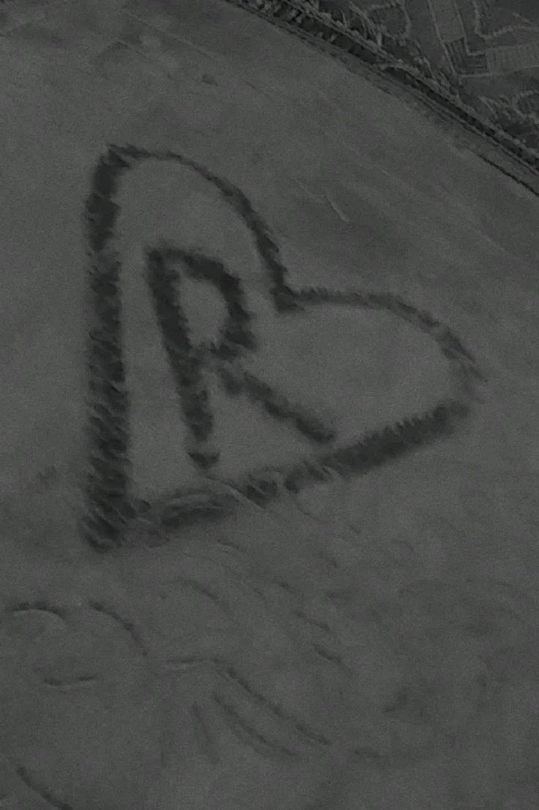

<!DOCTYPE html>
<html lang="ar" dir="rtl">
<head>
<meta charset="UTF-8">
<meta name="viewport" content="width=device-width, initial-scale=1.0">

<title>🎂 عيد ميلاد رودي ❤️</title>

</head>

<body>

<h1>🎉 عيد ميلاد سعيد يا رودي ❤️</h1>

عندي ليكي مفاجأة صغيرة 🎁

<button onclick="goToScene(2)">
ابدئي الرحلة ❤️
</button>

<h1>أجمل صورة ❤️</h1>

  

<button onclick="playMusic();goToScene(3)">
التالي ➜
</button>

<h1>🎂 Happy Birthday 🎂</h1>

كل سنة وانتي بخير ❤️  

يارب تكون سنة كلها فرحة وضحك وتحقيق لكل أحلامك 🌹

 

<button onclick="goToScene(4)">
افتحي الهدية 🎁
</button>

<h1>💖</h1>

وجودك في حياتي أحلى هدية ❤️

 

</body> 
</html>
